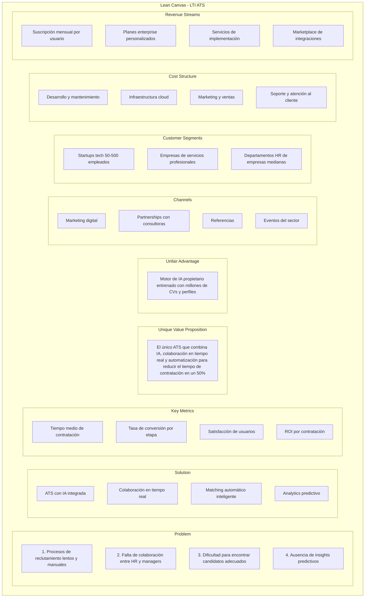
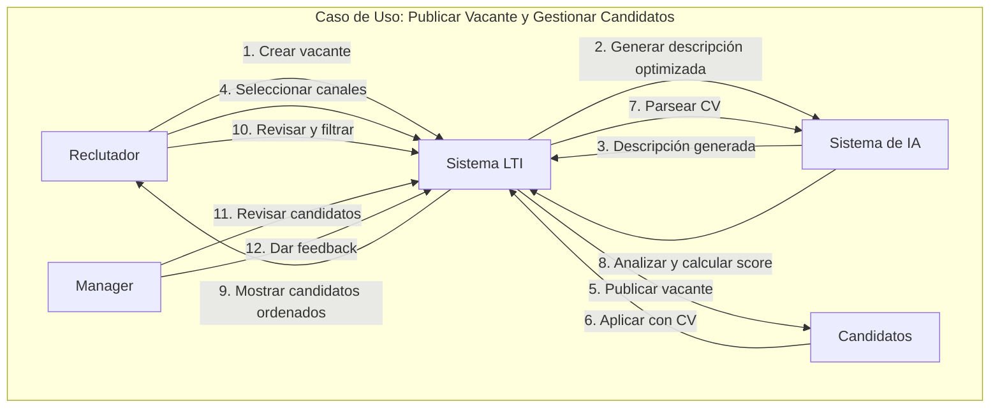
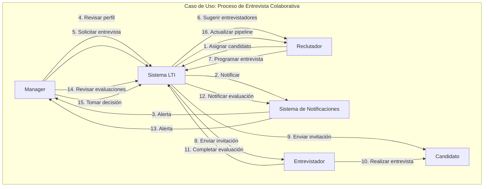
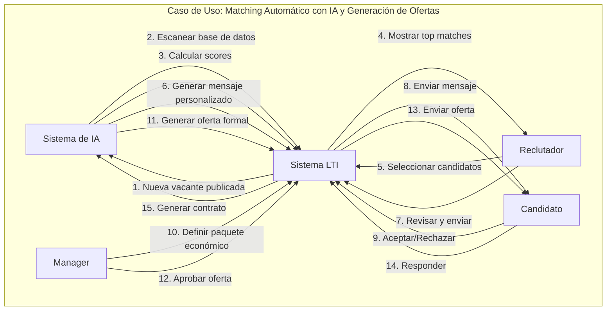
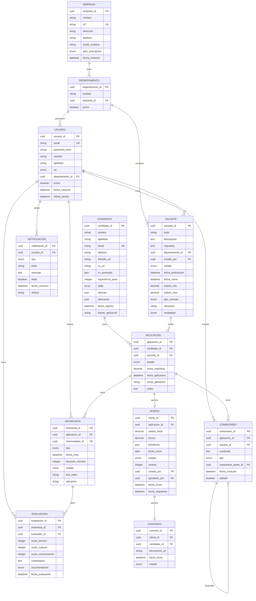
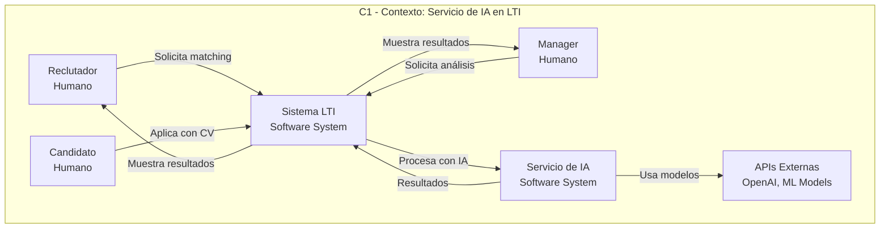
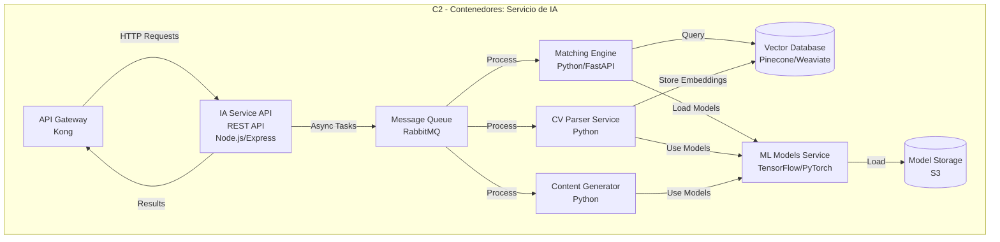
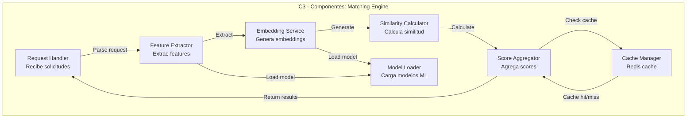

# LTI - Sistema ATS del Futuro
## Diseño y Documentación del Sistema

---

## Índice

1. [Descripción del Software LTI](#1-descripción-del-software-lti)
2. [Funciones Principales del Sistema](#2-funciones-principales-del-sistema)
3. [Lean Canvas](#3-lean-canvas)
4. [Casos de Uso Principales](#4-casos-de-uso-principales)
5. [Modelo de Datos](#5-modelo-de-datos)
6. [Diseño de Sistema a Alto Nivel](#6-diseño-de-sistema-a-alto-nivel)
7. [Diagrama C4 - Profundización en Componente](#7-diagrama-c4---profundización-en-componente)

---

## 1. Descripción del Software LTI

### 1.1 Propuesta de Valor

**LTI (Leading Talent Intelligence)** es una plataforma ATS (Applicant Tracking System) de nueva generación diseñada para transformar la forma en que las empresas gestionan el talento. Nuestro sistema combina inteligencia artificial, automatización avanzada y colaboración en tiempo real para crear una experiencia de reclutamiento sin precedentes.

### 1.2 Ventajas Competitivas

- **IA Integrada**: Asistente de IA que resume CVs, genera preguntas de entrevista personalizadas, y predice el fit cultural de candidatos
- **Colaboración en Tiempo Real**: Sistema de comentarios, notificaciones instantáneas y workflows colaborativos que eliminan silos entre HR, managers y entrevistadores
- **Automatización Inteligente**: Flujos de trabajo automatizados que reducen tareas manuales en un 70%, desde la publicación de ofertas hasta la generación de contratos
- **Analytics Predictivo**: Dashboards con métricas en tiempo real y predicciones sobre tiempo de contratación, calidad de candidatos y coste por contratación
- **Integración Omnicanal**: Publicación automática en múltiples portales de empleo, redes sociales y páginas corporativas desde una única plataforma
- **Experiencia Candidato Superior**: Portal de candidatos intuitivo con seguimiento en tiempo real del estado de su aplicación

---

## 2. Funciones Principales del Sistema

### 2.1 Gestión de Vacantes
- Creación y publicación de ofertas de trabajo
- Gestión de múltiples canales de publicación
- Configuración de requisitos y criterios de selección
- Seguimiento de métricas por vacante

### 2.2 Gestión de Candidatos
- Base de datos centralizada de candidatos
- Parsing inteligente de CVs (PDF, Word, texto)
- Búsqueda avanzada con filtros múltiples
- Historial completo de interacciones

### 2.3 Proceso de Selección
- Pipeline personalizable por vacante
- Asignación de candidatos a entrevistadores
- Programación automática de entrevistas
- Evaluaciones y feedback estructurado
- Sistema de scoring automático

### 2.4 Colaboración y Comunicación
- Comentarios en tiempo real sobre candidatos
- Notificaciones push y por email
- Chat interno entre miembros del equipo
- Compartir notas y evaluaciones

### 2.5 Automatización e IA
- Matching automático candidato-vacante
- Generación de preguntas de entrevista
- Resumen automático de CVs
- Predicción de éxito del candidato
- Respuestas automáticas a candidatos

### 2.6 Analytics y Reportes
- Dashboards ejecutivos
- Métricas de tiempo de contratación
- Análisis de fuentes de reclutamiento
- Reportes personalizables
- Exportación de datos

---

## 3. Lean Canvas

**Resumen del Modelo de Negocio:**

- **Problema**: Las empresas medianas y startups enfrentan procesos de reclutamiento ineficientes, falta de colaboración y ausencia de insights.
- **Solución**: Plataforma ATS con IA, automatización y colaboración en tiempo real.
- **Segmento**: Empresas de 50-500 empleados en sectores tech y servicios profesionales.
- **Propuesta de Valor**: Reducción del 50% en tiempo de contratación mediante IA y automatización.
- **Ventaja Competitiva**: Motor de IA propietario con datos masivos.
- **Canales**: Digital, partnerships, referencias y eventos.
- **Métricas Clave**: Tiempo de contratación, conversión, satisfacción y ROI.
- **Ingresos**: Suscripción SaaS por usuario + planes enterprise + servicios.
- **Costes**: Desarrollo, infraestructura, marketing y soporte.

---

## 4. Casos de Uso Principales

### 4.1 Caso de Uso 1: Publicar Vacante y Gestionar Candidatos

#### Descripción
Un reclutador necesita publicar una nueva vacante de trabajo, configurar los criterios de selección, y gestionar los candidatos que aplican a través de múltiples canales.

#### Actores
- **Reclutador (Principal)**: Usuario que crea y gestiona la vacante
- **Sistema de IA**: Asistente que analiza CVs y hace matching
- **Candidatos**: Aplican a la vacante
- **Manager**: Puede revisar candidatos y dar feedback

#### Flujo Principal
1. El Reclutador accede al módulo de Vacantes
2. Crea una nueva vacante con título, descripción, requisitos y criterios
3. El sistema genera automáticamente una descripción optimizada usando IA
4. El Reclutador selecciona canales de publicación (LinkedIn, Indeed, página web, etc.)
5. El sistema publica la vacante en los canales seleccionados
6. Los Candidatos aplican a través de los diferentes canales
7. El sistema recibe las aplicaciones y parsea los CVs automáticamente
8. El sistema de IA analiza cada CV y calcula un score de matching
9. El Reclutador visualiza los candidatos ordenados por score en el pipeline
10. El Reclutador puede filtrar, buscar y revisar candidatos

#### Flujos Alternativos

**4.1.1 CV no parseable**
- Si el CV no se puede parsear automáticamente, el sistema notifica al Reclutador
- El Reclutador puede subir manualmente la información o solicitar al candidato que complete un formulario

**4.1.2 Matching bajo**
- Si ningún candidato tiene un score superior al 60%, el sistema sugiere al Reclutador:
  - Ampliar los criterios de búsqueda
  - Publicar en canales adicionales
  - Ajustar los requisitos de la vacante

#### Diagrama de Caso de Uso

---

### 4.2 Caso de Uso 2: Proceso de Entrevista Colaborativa

#### Descripción
Un manager y un reclutador colaboran en tiempo real para evaluar candidatos, programar entrevistas, y tomar decisiones de contratación basadas en feedback estructurado.

#### Actores
- **Manager (Principal)**: Evalúa candidatos y toma decisiones
- **Reclutador**: Coordina el proceso y programa entrevistas
- **Entrevistador**: Realiza entrevistas técnicas/funcionales
- **Sistema de Notificaciones**: Envía alertas en tiempo real
- **Candidato**: Asiste a entrevistas

#### Flujo Principal
1. El Reclutador asigna un candidato a un Manager para revisión
2. El sistema notifica al Manager por email y push notification
3. El Manager accede al perfil del candidato y revisa CV, score y notas previas
4. El Manager solicita una entrevista técnica
5. El sistema sugiere entrevistadores disponibles basado en la vacante
6. El Reclutador programa la entrevista usando el calendario integrado
7. El sistema envía invitación al Entrevistador y al Candidato
8. Se realiza la entrevista (presencial o virtual)
9. El Entrevistador completa un formulario de evaluación estructurado
10. El Manager recibe notificación de la evaluación completada
11. El Manager revisa todas las evaluaciones y comentarios en tiempo real
12. El Manager toma una decisión: Aprobar, Rechazar o Solicitar más información
13. El sistema actualiza el pipeline y notifica al Reclutador
14. Si se aprueba, el Reclutador inicia el proceso de oferta

#### Flujos Alternativos

**4.2.1 Conflicto de horarios**
- Si el candidato no puede en el horario propuesto, el sistema sugiere alternativas
- El Reclutador puede reprogramar automáticamente

**4.2.2 Evaluación negativa**
- Si la evaluación es negativa, el sistema sugiere al Manager opciones:
  - Rechazar inmediatamente
  - Solicitar segunda opinión
  - Mantener en standby

**4.2.3 Decisión por consenso**
- Si hay múltiples evaluadores con opiniones divididas, el sistema crea un hilo de discusión
- El Manager puede solicitar una reunión de consenso

#### Diagrama de Caso de Uso

---

### 4.3 Caso de Uso 3: Matching Automático con IA y Generación de Ofertas

#### Descripción
El sistema utiliza IA para hacer matching automático entre candidatos existentes en la base de datos y nuevas vacantes, y genera ofertas de trabajo personalizadas para candidatos aprobados.

#### Actores
- **Sistema de IA (Principal)**: Motor de matching y generación
- **Reclutador**: Revisa matches y gestiona ofertas
- **Candidato**: Recibe ofertas y responde
- **Manager**: Aprueba ofertas económicas

#### Flujo Principal
1. Se publica una nueva vacante con requisitos detallados
2. El sistema de IA escanea automáticamente la base de datos de candidatos
3. El sistema calcula un score de matching para cada candidato (0-100)
4. El sistema ordena candidatos por score y muestra top 20 al Reclutador
5. El Reclutador revisa los matches sugeridos
6. El Reclutador selecciona candidatos para contactar
7. El sistema genera automáticamente un mensaje personalizado usando IA
8. El Reclutador revisa y edita el mensaje si es necesario
9. El sistema envía el mensaje al Candidato
10. Si el Candidato acepta, se inicia el proceso de entrevista
11. Tras aprobar las entrevistas, el Manager define el paquete económico
12. El sistema genera una oferta formal usando plantillas y datos del candidato
13. El Manager revisa y aprueba la oferta
14. El sistema envía la oferta al Candidato
15. El Candidato puede aceptar, rechazar o negociar
16. Si acepta, el sistema genera el contrato automáticamente

#### Flujos Alternativos

**4.3.1 Sin matches suficientes**
- Si hay menos de 5 candidatos con score >70%, el sistema sugiere:
  - Ampliar criterios de búsqueda
  - Considerar candidatos con experiencia transferible
  - Activar búsqueda activa (headhunting)

**4.3.2 Candidato no responde**
- Si el candidato no responde en 7 días, el sistema envía recordatorio automático
- Si no responde en 14 días, marca como "no disponible" y sugiere alternativas

**4.3.3 Negociación de oferta**
- Si el candidato negocia, el Manager puede ajustar la oferta
- El sistema mantiene historial de versiones de la oferta
- Una vez acordada, genera el contrato final

#### Diagrama de Caso de Uso

---

## 5. Modelo de Datos

### 5.1 Entidades y Atributos

#### **Usuario**
- `usuario_id` (UUID, PK)
- `email` (String, Unique, NotNull)
- `password_hash` (String, NotNull)
- `nombre` (String, NotNull)
- `apellidos` (String, NotNull)
- `rol` (Enum: RECLUTADOR, MANAGER, ENTREVISTADOR, ADMIN, NotNull)
- `departamento_id` (UUID, FK)
- `activo` (Boolean, Default: true)
- `fecha_creacion` (DateTime)
- `ultima_sesion` (DateTime)

#### **Departamento**
- `departamento_id` (UUID, PK)
- `nombre` (String, NotNull)
- `empresa_id` (UUID, FK)
- `activo` (Boolean, Default: true)

#### **Empresa**
- `empresa_id` (UUID, PK)
- `nombre` (String, NotNull)
- `cif` (String, Unique)
- `direccion` (String)
- `telefono` (String)
- `email_contacto` (String)
- `plan_suscripcion` (Enum: BASIC, PRO, ENTERPRISE)
- `fecha_creacion` (DateTime)

#### **Vacante**
- `vacante_id` (UUID, PK)
- `titulo` (String, NotNull)
- `descripcion` (Text, NotNull)
- `requisitos` (JSON)
- `departamento_id` (UUID, FK)
- `creado_por` (UUID, FK -> Usuario)
- `estado` (Enum: BORRADOR, PUBLICADA, PAUSADA, CERRADA)
- `fecha_publicacion` (DateTime)
- `fecha_cierre` (DateTime)
- `salario_min` (Decimal)
- `salario_max` (Decimal)
- `tipo_contrato` (Enum: INDEFINIDO, TEMPORAL, PRACTICAS)
- `ubicacion` (String)
- `modalidad` (Enum: PRESENCIAL, REMOTO, HIBRIDO)

#### **Candidato**
- `candidato_id` (UUID, PK)
- `nombre` (String, NotNull)
- `apellidos` (String, NotNull)
- `email` (String, Unique, NotNull)
- `telefono` (String)
- `linkedin_url` (String)
- `cv_url` (String)
- `cv_parseado` (JSON)
- `experiencia_anos` (Integer)
- `skills` (Array<String>)
- `idiomas` (JSON)
- `educacion` (JSON)
- `fecha_registro` (DateTime)
- `fuente_aplicacion` (String)

#### **Aplicacion**
- `aplicacion_id` (UUID, PK)
- `candidato_id` (UUID, FK)
- `vacante_id` (UUID, FK)
- `estado` (Enum: NUEVA, EN_REVISION, ENTREVISTA, OFERTA, CONTRATADO, RECHAZADO)
- `score_matching` (Decimal, 0-100)
- `fecha_aplicacion` (DateTime)
- `canal_aplicacion` (String)
- `notas` (Text)

#### **Entrevista**
- `entrevista_id` (UUID, PK)
- `aplicacion_id` (UUID, FK)
- `entrevistador_id` (UUID, FK -> Usuario)
- `tipo` (Enum: TELEFONICA, VIDEO, PRESENCIAL, TECNICA)
- `fecha_hora` (DateTime, NotNull)
- `duracion_minutos` (Integer)
- `estado` (Enum: PROGRAMADA, COMPLETADA, CANCELADA)
- `link_video` (String)
- `ubicacion` (String)

#### **Evaluacion**
- `evaluacion_id` (UUID, PK)
- `entrevista_id` (UUID, FK)
- `evaluador_id` (UUID, FK -> Usuario)
- `score_tecnico` (Integer, 1-10)
- `score_cultural` (Integer, 1-10)
- `score_comunicacion` (Integer, 1-10)
- `comentarios` (Text)
- `recomendacion` (Enum: APROBAR, RECHAZAR, SEGUNDA_OPINION)
- `fecha_evaluacion` (DateTime)

#### **Comentario**
- `comentario_id` (UUID, PK)
- `aplicacion_id` (UUID, FK)
- `usuario_id` (UUID, FK)
- `contenido` (Text, NotNull)
- `tipo` (Enum: NOTA, PREGUNTA, RESPUESTA)
- `comentario_padre_id` (UUID, FK -> Comentario, Nullable)
- `fecha_creacion` (DateTime)
- `editado` (Boolean)

#### **Oferta**
- `oferta_id` (UUID, PK)
- `aplicacion_id` (UUID, FK)
- `salario_base` (Decimal, NotNull)
- `bonus` (Decimal)
- `beneficios` (JSON)
- `fecha_inicio` (Date)
- `estado` (Enum: BORRADOR, ENVIADA, ACEPTADA, RECHAZADA, NEGOCIACION)
- `version` (Integer, Default: 1)
- `creado_por` (UUID, FK -> Usuario)
- `aprobado_por` (UUID, FK -> Usuario)
- `fecha_envio` (DateTime)
- `fecha_respuesta` (DateTime)

#### **Contrato**
- `contrato_id` (UUID, PK)
- `oferta_id` (UUID, FK)
- `candidato_id` (UUID, FK)
- `documento_url` (String)
- `fecha_firma` (DateTime)
- `estado` (Enum: PENDIENTE, FIRMADO, CANCELADO)

#### **Notificacion**
- `notificacion_id` (UUID, PK)
- `usuario_id` (UUID, FK)
- `tipo` (Enum: ASIGNACION, COMENTARIO, ENTREVISTA, OFERTA, SISTEMA)
- `titulo` (String, NotNull)
- `mensaje` (Text)
- `leida` (Boolean, Default: false)
- `fecha_creacion` (DateTime)
- `enlace` (String)

### 5.2 Relaciones

- **Empresa** 1:N **Departamento**
- **Departamento** 1:N **Usuario**
- **Departamento** 1:N **Vacante**
- **Usuario** 1:N **Vacante** (creado_por)
- **Usuario** 1:N **Entrevista** (entrevistador)
- **Usuario** 1:N **Evaluacion** (evaluador)
- **Usuario** 1:N **Comentario**
- **Usuario** 1:N **Notificacion**
- **Candidato** 1:N **Aplicacion**
- **Vacante** 1:N **Aplicacion**
- **Aplicacion** 1:N **Entrevista**
- **Aplicacion** 1:N **Comentario**
- **Aplicacion** 0:1 **Oferta**
- **Entrevista** 1:N **Evaluacion**
- **Oferta** 0:1 **Contrato**
- **Comentario** 0:1 **Comentario** (auto-relación, comentario_padre)

### 5.3 Diagrama Entidad-Relación

---

## 6. Diseño de Sistema a Alto Nivel

### 6.1 Arquitectura Propuesta

LTI adopta una **arquitectura de microservicios** basada en cloud, diseñada para escalabilidad, alta disponibilidad y mantenibilidad. La arquitectura se compone de los siguientes componentes principales:

#### **6.1.1 Frontend (Cliente Web)**
- **Tecnología**: React con TypeScript
- **Arquitectura**: SPA (Single Page Application) con routing client-side
- **Estado**: Redux Toolkit para gestión de estado global
- **UI**: Material-UI o Ant Design para componentes
- **Comunicación**: REST API y WebSockets para tiempo real

#### **6.1.2 API Gateway**
- **Función**: Punto de entrada único para todas las peticiones
- **Responsabilidades**: 
  - Autenticación y autorización
  - Rate limiting
  - Enrutamiento a microservicios
  - Load balancing
- **Tecnología**: Kong, AWS API Gateway o similar

#### **6.1.3 Microservicios Backend**

**Servicio de Autenticación y Autorización**
- Gestión de usuarios y sesiones
- JWT tokens
- OAuth2/SSO

**Servicio de Gestión de Vacantes**
- CRUD de vacantes
- Publicación multi-canal
- Gestión de estados

**Servicio de Gestión de Candidatos**
- Base de datos de candidatos
- Parsing de CVs
- Búsqueda y filtrado

**Servicio de Proceso de Selección**
- Pipeline de candidatos
- Gestión de aplicaciones
- Scoring y matching

**Servicio de Colaboración**
- Comentarios en tiempo real
- Notificaciones push
- Chat interno

**Servicio de IA y Automatización**
- Motor de matching
- Análisis de CVs
- Generación de contenido
- Predicciones

**Servicio de Entrevistas**
- Programación de entrevistas
- Integración con calendarios
- Gestión de evaluaciones

**Servicio de Ofertas y Contratos**
- Generación de ofertas
- Gestión de negociaciones
- Generación de contratos

**Servicio de Analytics**
- Agregación de métricas
- Dashboards
- Reportes

#### **6.1.4 Servicios de Infraestructura**

**Base de Datos**
- **Principal**: PostgreSQL para datos transaccionales
- **Cache**: Redis para sesiones y datos frecuentes
- **Búsqueda**: Elasticsearch para búsqueda full-text
- **Archivos**: S3 o similar para CVs y documentos

**Message Queue**
- **Tecnología**: RabbitMQ o Apache Kafka
- **Uso**: Comunicación asíncrona entre servicios, procesamiento de eventos

**Service Discovery**
- **Tecnología**: Consul o Eureka
- **Función**: Registro y descubrimiento de servicios

**Monitoring y Logging**
- **Logging**: ELK Stack (Elasticsearch, Logstash, Kibana)
- **Monitoring**: Prometheus + Grafana
- **Tracing**: Jaeger o Zipkin

#### **6.1.5 Integraciones Externas**
- Portales de empleo (LinkedIn, Indeed, InfoJobs)
- Servicios de email (SendGrid, AWS SES)
- Calendarios (Google Calendar, Outlook)
- Video conferencia (Zoom, Google Meet)
- Firmas electrónicas (DocuSign)

### 6.2 Diagrama de Arquitectura de Alto Nivel

```mermaid
graph TB
    subgraph "Cliente"
        WebApp[Web Application<br/>React + TypeScript]
        MobileApp[Mobile App<br/>React Native]
    end

    subgraph "API Layer"
        APIGateway[API Gateway<br/>Kong/AWS API Gateway]
    end

    subgraph "Microservicios"
        AuthSvc[Auth Service<br/>JWT, OAuth]
        VacanteSvc[Vacante Service]
        CandidatoSvc[Candidato Service]
        SeleccionSvc[Selección Service]
        ColabSvc[Colaboración Service<br/>WebSockets]
        IASvc[IA Service<br/>ML Engine]
        EntrevistaSvc[Entrevista Service]
        OfertaSvc[Oferta Service]
        AnalyticsSvc[Analytics Service]
    end

    subgraph "Data Layer"
        PostgreSQL[(PostgreSQL<br/>Datos Transaccionales)]
        Redis[(Redis<br/>Cache & Sessions)]
        Elasticsearch[(Elasticsearch<br/>Búsqueda)]
        S3[(S3/Object Storage<br/>CVs & Docs)]
    end

    subgraph "Message Queue"
        RabbitMQ[RabbitMQ/Kafka<br/>Event Bus]
    end

    subgraph "External Services"
        LinkedIn[LinkedIn API]
        Indeed[Indeed API]
        EmailSvc[Email Service<br/>SendGrid]
        Calendar[Calendar APIs]
        VideoConf[Video Conference<br/>Zoom/Meet]
    end

    subgraph "Infrastructure"
        ServiceDiscovery[Service Discovery<br/>Consul]
        Monitoring[Monitoring<br/>Prometheus + Grafana]
        Logging[Logging<br/>ELK Stack]
    end

    WebApp --> APIGateway
    MobileApp --> APIGateway
    
    APIGateway --> AuthSvc
    APIGateway --> VacanteSvc
    APIGateway --> CandidatoSvc
    APIGateway --> SeleccionSvc
    APIGateway --> ColabSvc
    APIGateway --> IASvc
    APIGateway --> EntrevistaSvc
    APIGateway --> OfertaSvc
    APIGateway --> AnalyticsSvc

    AuthSvc --> PostgreSQL
    VacanteSvc --> PostgreSQL
    CandidatoSvc --> PostgreSQL
    SeleccionSvc --> PostgreSQL
    EntrevistaSvc --> PostgreSQL
    OfertaSvc --> PostgreSQL

    CandidatoSvc --> Elasticsearch
    VacanteSvc --> Elasticsearch

    ColabSvc --> Redis
    AuthSvc --> Redis

    CandidatoSvc --> S3
    OfertaSvc --> S3

    VacanteSvc --> RabbitMQ
    SeleccionSvc --> RabbitMQ
    IASvc --> RabbitMQ
    ColabSvc --> RabbitMQ

    VacanteSvc --> LinkedIn
    VacanteSvc --> Indeed
    EntrevistaSvc --> Calendar
    EntrevistaSvc --> VideoConf
    OfertaSvc --> EmailSvc

    IASvc --> RabbitMQ
    RabbitMQ --> IASvc

    ServiceDiscovery -.-> AuthSvc
    ServiceDiscovery -.-> VacanteSvc
    ServiceDiscovery -.-> CandidatoSvc
    ServiceDiscovery -.-> SeleccionSvc

    Monitoring -.-> AuthSvc
    Monitoring -.-> VacanteSvc
    Logging -.-> AuthSvc
    Logging -.-> VacanteSvc
```

### 6.3 Flujo de Datos Principal

1. **Cliente** realiza petición a **API Gateway**
2. **API Gateway** valida autenticación y enruta a **Microservicio** correspondiente
3. **Microservicio** procesa la petición, consulta **Base de Datos** si es necesario
4. Si requiere procesamiento asíncrono, publica evento en **Message Queue**
5. Otros servicios consumen eventos y procesan en background
6. **Servicio de IA** procesa tareas de ML y publica resultados
7. **Servicio de Colaboración** usa **WebSockets** para notificaciones en tiempo real
8. Respuesta se envía de vuelta al cliente a través del **API Gateway**

### 6.4 Principios de Diseño

- **Escalabilidad Horizontal**: Cada microservicio puede escalarse independientemente
- **Alta Disponibilidad**: Múltiples instancias de cada servicio con load balancing
- **Resiliencia**: Circuit breakers y retry policies
- **Seguridad**: Autenticación centralizada, encriptación de datos sensibles
- **Observabilidad**: Logging, monitoring y tracing distribuido
- **Desacoplamiento**: Comunicación asíncrona mediante eventos

---

## 7. Diagrama C4 - Profundización en Componente

### 7.1 Componente Seleccionado: Servicio de IA y Automatización

Este componente es crítico para la propuesta de valor de LTI, ya que proporciona las capacidades de matching inteligente, análisis de CVs y generación de contenido que diferencian al sistema de la competencia.

### 7.2 Nivel C1 - Contexto del Sistema

**Descripción**: El Servicio de IA actúa como un componente interno del Sistema LTI, procesando solicitudes de usuarios (Reclutadores, Managers) y datos de candidatos para proporcionar capacidades inteligentes.

### 7.3 Nivel C2 - Contenedores del Servicio de IA

**Descripción de Contenedores**:

- **IA Service API**: Endpoint REST que recibe solicitudes y las encola para procesamiento asíncrono
- **Matching Engine**: Calcula scores de matching entre candidatos y vacantes usando embeddings vectoriales
- **CV Parser Service**: Extrae y estructura información de CVs en múltiples formatos
- **Content Generator**: Genera descripciones de vacantes, mensajes personalizados y preguntas de entrevista
- **ML Models Service**: Gestiona y sirve modelos de machine learning (clasificación, NER, generación de texto)
- **Vector Database**: Almacena embeddings de candidatos y vacantes para búsqueda semántica
- **Model Storage**: Almacena modelos entrenados y versionados

### 7.4 Nivel C3 - Componentes del Matching Engine

**Descripción de Componentes**:

- **Request Handler**: Procesa solicitudes de matching, valida inputs y coordina el flujo
- **Feature Extractor**: Extrae features relevantes de candidatos y vacantes (skills, experiencia, educación)
- **Embedding Service**: Genera embeddings vectoriales usando modelos de transformer (BERT, Sentence-BERT)
- **Similarity Calculator**: Calcula similitud coseno entre embeddings de candidato y vacante
- **Score Aggregator**: Combina múltiples factores (similitud, experiencia, skills, educación) en un score final 0-100
- **Cache Manager**: Cachea resultados de matching para evitar recálculos
- **Model Loader**: Carga modelos ML desde storage de forma eficiente

### 7.5 Flujo Detallado del Matching

1. **Request Handler** recibe solicitud de matching (vacante_id)
2. **Feature Extractor** extrae features de la vacante (requisitos, descripción, skills)
3. **Embedding Service** genera embedding de la vacante usando modelo de lenguaje
4. **Embedding Service** genera embeddings de candidatos en la base de datos (batch processing)
5. **Similarity Calculator** calcula similitud coseno entre embedding de vacante y cada candidato
6. **Score Aggregator** combina similitud con factores adicionales:
   - Años de experiencia vs requeridos
   - Match de skills específicos
   - Match de educación/estudios
   - Historial previo (si el candidato ya aplicó antes)
7. **Cache Manager** almacena resultados para futuras consultas
8. **Request Handler** retorna top N candidatos ordenados por score

### 7.6 Tecnologías Específicas

- **Lenguajes**: Python (matching, parsing), Node.js (API)
- **ML Frameworks**: TensorFlow, PyTorch, Transformers (Hugging Face)
- **Embeddings**: Sentence-BERT, OpenAI embeddings
- **Vector DB**: Pinecone o Weaviate para búsqueda semántica
- **NLP**: spaCy para NER, NLTK para procesamiento de texto
- **Cache**: Redis para resultados frecuentes
- **Queue**: RabbitMQ para procesamiento asíncrono

---

### Puntos Clave del Diseño

1. **Arquitectura Escalable**: Microservicios que permiten escalar componentes independientemente
2. **IA Integrada**: Motor de matching y análisis que reduce tiempo de contratación
3. **Colaboración Real**: Sistema de notificaciones y comentarios en tiempo real
4. **Automatización Completa**: Desde publicación hasta generación de contratos
5. **Datos Estructurados**: Modelo de datos robusto que soporta todo el flujo de reclutamiento

